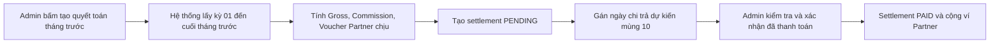
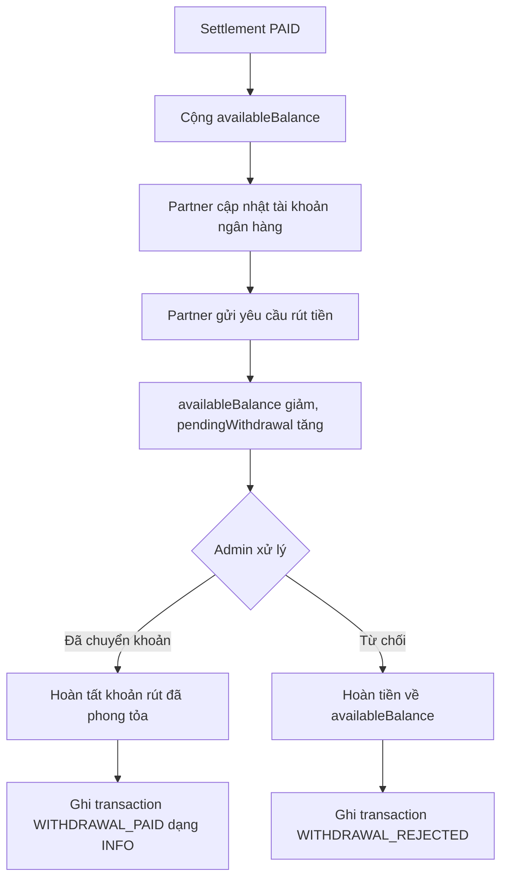

# TravelMate — Báo Cáo Kiểm Thử Settlement / Wallet

**Ngày cập nhật:** 2026-05-27  
**Phạm vi:** Quyết toán tháng, ví Partner, yêu cầu rút tiền, export Excel và phân quyền route liên quan.

---

## 1. Kết Luận

Module settlement/wallet đã đáp ứng phạm vi demo đồ án và đã qua kiểm thử tự động. Luồng chính hiện có thể chuyển sang kiểm thử thủ công trên browser trước khi bảo vệ.

| Hạng mục | Trạng thái |
|---|---|
| Quyết toán tháng mùng 10 | Đạt |
| Ví quyết toán Partner | Đạt |
| Lịch sử giao dịch tiền vào/ra | Đạt |
| Partner cập nhật tài khoản nhận tiền | Đạt |
| Partner tạo yêu cầu rút tiền | Đạt |
| Admin xác nhận/từ chối withdrawal | Đạt |
| Không trừ tiền hai lần khi Admin xác nhận đã chuyển khoản | Đạt |
| Export Excel settlement/withdrawal | Đạt |
| Test tự động | **234 pass**, 0 fail, 0 error |

---

## 2. Luồng Nghiệp Vụ Đúng

### 2.1 Quyết toán tháng

Hệ thống hỗ trợ Admin tạo quyết toán cho tháng trước. Khi tạo, hệ thống tự động xác định kỳ quyết toán, tính doanh thu đủ điều kiện và gán ngày chi trả dự kiến là mùng 10 của tháng hiện tại.



### 2.2 Ví Partner và rút tiền



Điểm quan trọng: khi Admin xác nhận đã chuyển khoản, hệ thống không trừ `availableBalance` lần nữa. Số tiền đã được phong tỏa từ lúc Partner tạo yêu cầu rút.

---

## 3. Công Thức Quyết Toán

```text
Payout = GrossAmount - CommissionAmount - PartnerVoucherDeduction
```

| Thành phần | Ý nghĩa |
|---|---|
| `GrossAmount` | Tổng tiền online hợp lệ TravelMate đang giữ |
| `CommissionAmount` | Hoa hồng TravelMate theo loại cơ sở/phòng |
| `PartnerVoucherDeduction` | Voucher do đối tác chịu |
| Voucher Admin chịu | Không trừ vào số tiền đối tác nhận |

TravelMate chỉ tính commission trên khoản khách thanh toán online. Với booking `DEPOSIT_30` hoàn tất hoặc mất cọc, hệ thống chỉ đưa phần cọc online 30% vào doanh thu/quyết toán; 70% khách trả tại cơ sở không vào ví TravelMate. Đối tác nhận phần tiền online còn lại sau khi trừ commission và voucher do đối tác chịu nếu có.

---

## 4. Kết Quả Test Tự Động

Lần chạy gần nhất được xác nhận từ `target/surefire-reports` ngày 2026-05-27.

| Nhóm test | Số lượng | Kết quả |
|---|---:|---|
| Unit/service/template/static/integration tests | 234 | PASS |
| **Tổng cộng** | **234** | **PASS** |

Kết quả kỳ vọng sau khi chạy:

```text
Tests run: 234, Failures: 0, Errors: 0, Skipped: 0
BUILD SUCCESS
```

Integration test đã bao phủ:

| Chức năng | Kiểm thử |
|---|---|
| Phân quyền Admin/Partner/User | USER bị chặn khi vào route Admin/Partner |
| Admin settlements | Mở danh sách settlement thành công |
| Admin withdrawals | Mở danh sách withdrawal thành công |
| Export Excel settlement | `GET /admin/settlements/{id}/export-excel` trả file XLSX |
| Export Excel settlement ID sai | `GET /admin/settlements/999999/export-excel` trả 404, không lỗi 500 |
| Export Excel withdrawals | `GET /admin/withdrawals/export-excel` trả file XLSX |
| Partner wallet | Xem ví, transaction, withdrawal |
| Bank info | Cập nhật hợp lệ và chặn số tài khoản sai |
| Withdrawal | Chặn rút vượt số dư khả dụng |

---

## 5. Dữ Liệu Demo Trong SQL Gốc

File chính: `travelmate/src/main/resources/travelmate_db.sql`

| Dữ liệu | Trạng thái |
|---|---|
| Partner settlements theo tháng | Có PAID và PENDING |
| Scheduled payout date | Mùng 10 tháng sau kỳ quyết toán |
| Partner wallets | Có số dư, pending, total earned, total withdrawn |
| Withdrawal requests | Có PENDING, PAID, REJECTED |
| Wallet transactions | Có settlement credit, withdrawal request, paid, rejected |
| Unique index chống cộng settlement trùng | `uk_wallet_tx_settlement_credit` |
| Đối tác Palace | `contact@dalatpalacehotel.vn / partner123`, có bank info, ví và withdrawal đủ trạng thái |
| Đối tác Rừng Thông | `info@rungthongdalat.vn / partner123`, có tiền nhưng chưa có bank info để test chặn rút |
| Booking test settlement | 2 booking đủ điều kiện, 1 booking DIRECT bị loại, 1 booking chưa hoàn tất bị loại |

Kịch bản chính cho `contact@dalatpalacehotel.vn`:

| Luồng | Dữ liệu kỳ vọng |
|---|---:|
| Gross settlement tháng trước | 2.250.000đ |
| Commission TravelMate | 337.500đ |
| Voucher Partner chịu | 200.000đ |
| Partner payout | 1.712.500đ |
| Ví ban đầu | available 2.200.000đ, pending 800.000đ, earned 4.000.000đ, withdrawn 1.000.000đ |

SQL gốc đã được import kiểm tra trên database tạm để xác nhận các bảng chính tạo được user, booking, wallet, withdrawal và transaction history không lỗi.

---

## 6. Checklist Test Thủ Công Trước Demo

1. Import lại `travelmate_db.sql` vào MySQL local.
2. Đăng nhập Admin: `admin@travelmate.vn / admin123`.
3. Vào `/admin/settlements`, mở chi tiết settlement và xuất Excel.
4. Xác nhận thanh toán một settlement PENDING.
5. Đăng nhập Partner: `contact@dalatpalacehotel.vn / partner123`.
6. Vào `/partner/wallet`, kiểm tra ví đối tác có đủ số dư, pending withdrawal và lịch sử tiền vào/ra.
7. Cập nhật tài khoản ngân hàng Partner.
8. Gửi yêu cầu rút tiền hợp lệ.
9. Admin vào `/admin/withdrawals`, xuất Excel withdrawal.
10. Admin xác nhận đã chuyển khoản hoặc từ chối một yêu cầu rút.
11. Partner kiểm tra lại số dư và lịch sử giao dịch.
12. Test regression booking VNPAY cọc 30%, full payment và no-show.

---

## 7. Ghi Chú Bảo Vệ

TravelMate chưa tích hợp chuyển khoản ngân hàng thật. Ví Partner là sổ quyết toán nội bộ: hệ thống ghi nhận số dư, phong tỏa tiền khi Partner yêu cầu rút, và Admin cập nhật trạng thái sau khi chuyển khoản ngoài hệ thống.

Kết luận phù hợp để trình bày:

> Module settlement/wallet đã đáp ứng phạm vi demo đồ án, có dữ liệu đối soát trực quan, có export Excel đối soát và đã qua kiểm thử tự động. Nhóm vẫn cần kiểm thử thủ công trên browser trước buổi bảo vệ để xác nhận trải nghiệm UI và luồng VNPAY sandbox.
